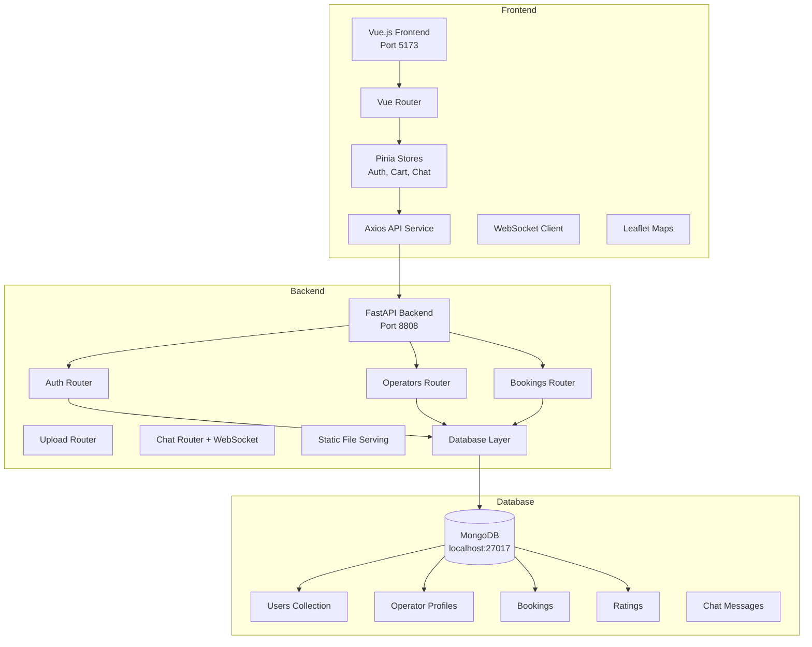

# Tour App - Development Tracker & Architecture

**Last Updated:** February 5, 2026  
**Project Status:** ✅ MVP Complete - All High-Priority Features + Kubernetes Deployment Ready

---

## Latest Updates (February 5, 2026)

### 🚀 NEW: Kubernetes Deployment with Terraform
- ✅ Platform-agnostic Terraform configuration for any Kubernetes cluster
- ✅ Supports AWS EKS, Google GKE, Azure AKS, Minikube, Docker Desktop, self-managed Kubernetes
- ✅ MongoDB StatefulSet with persistent storage and automatic initialization
- ✅ FastAPI backend deployment with ConfigMap, Secrets, HPA (Horizontal Pod Autoscaler)
- ✅ Vue.js frontend deployment with Nginx proxy and HPA
- ✅ Ingress configuration for routing traffic to frontend and backend
- ✅ Service discovery and inter-pod communication
- ✅ Resource limits, liveness/readiness probes, pod affinity rules
- ✅ Health checks for all components
- ✅ Automatic secret generation for MongoDB and JWT
- ✅ Docker images with multi-stage builds (optimized, non-root users, health checks)

**Related Files:**
- `terraform/` - Complete Terraform configuration
  - [main.tf](terraform/main.tf) - Provider and namespace setup
  - [variables.tf](terraform/variables.tf) - Configurable variables (70+ options)
  - [database.tf](terraform/database.tf) - MongoDB deployment with PVC
  - [backend.tf](terraform/backend.tf) - FastAPI backend with HPA
  - [frontend.tf](terraform/frontend.tf) - Vue frontend with HPA
  - [ingress.tf](terraform/ingress.tf) - Traffic routing configuration
  - [outputs.tf](terraform/outputs.tf) - Deployment info and kubectl commands
  - [terraform.tfvars.example](terraform/terraform.tfvars.example) - Example configuration
  - [README.md](terraform/README.md) - Terraform-specific instructions
- [backend/Dockerfile](backend/Dockerfile) - Optimized backend image
- [frontend/Dockerfile](frontend/Dockerfile) - Optimized frontend image
- [KUBERNETES_DEPLOYMENT.md](KUBERNETES_DEPLOYMENT.md) - Complete deployment guide

---

## Latest Updates (January 22, 2026)

### 🎯 NEW: Serving Area Edit & Delete Capability
- ✅ Operators can edit existing serving areas (name, state, country, description, images, coordinates)
- ✅ Operators can delete serving areas with confirmation dialog
- ✅ Backend endpoints: PUT `/operators/profile/serving-areas/{area_index}` and DELETE `/operators/profile/serving-areas/{area_index}`
- ✅ Frontend UI: Edit/Delete buttons on each serving area card in dashboard
- ✅ Form reuses add form for both create and edit modes
- ✅ Auto-scroll to form when editing area
- ✅ Coordinate validation enforced on updates

**Related Files Updated:**
- [backend/routers/operators.py](backend/routers/operators.py) - Added PUT and DELETE endpoints
- [frontend/src/views/OperatorDashboard.vue](frontend/src/views/OperatorDashboard.vue) - Added edit/delete UI and functions

### 🛠️ UX Improvements
- Tabs use non-submitting buttons and now reset open forms on tab change
- Edit/Add serving area form closes on save and cancel consistently
- Auto-scroll to the edit form when entering edit mode
- Map selection simplified: clicking on the map immediately sets coordinates; removed the extra "Confirm Location" button

### 📋 NEW: Tourist Review System
- ✅ Tourists can only review bookings after operator confirms them (status = "completed")
- ✅ Review form in BookingDetails page with 5-star rating system
- ✅ Optional text review and category-based ratings (hospitality, value, experience)
- ✅ Backend enforces completed status before allowing review submission
- ✅ Operator average rating auto-updates when tourist submits review
- ✅ "Leave Review" action button appears on completed bookings in MyBookings list
- ✅ Backend prevents duplicate reviews for the same booking
- ✅ Tourists can edit their reviews after submission
- ✅ Edit form pre-fills with existing review data
- ✅ Backend validates ownership before allowing edits

**Related Files Updated:**
- [frontend/src/views/BookingDetails.vue](frontend/src/views/BookingDetails.vue) - Added review form, edit mode, and submission/update logic
- [frontend/src/views/MyBookings.vue](frontend/src/views/MyBookings.vue) - Added "Leave Review" button for completed bookings
- [backend/routers/bookings.py](backend/routers/bookings.py) - Added GET and PUT endpoints for reviews; enforces completed status

---

## Previous Updates (January 21, 2026)

### 🎉 NEW: Custom Quote Request System
- ✅ Tourists can search & discover any location worldwide, not just operator locations
- ✅ Build custom "bucket" with multiple locations on interactive map
- ✅ Publish quote requests with budget, timing, traveler count, notes
- ✅ Operators see incoming quote requests in dashboard with location map
- ✅ Operators respond with custom amounts & messages
- ✅ Chat directly from quote for negotiation
- ✅ All sub-locations have coordinates for "View on Map" feature
- ✅ Nomad location search powered by OpenStreetMap Nominatim

### 📍 Sub-Location Coordinates Backfill Complete
- Backfilled 12 existing sub-locations with real GPS coordinates
- Created [backend/scripts/backfill_coordinates.py](backend/scripts/backfill_coordinates.py)
- "View on Map" modal now works everywhere
- Tourist can click button to see exact location on interactive map

---

## Project Overview

A full-stack web application connecting tour operators with tourists, enabling:
- Operators to showcase their services, manage locations, and handle bookings
- Tourists to search locations, plan trips, and book tours
- Photo galleries and interactive maps for locations
- Real-time chat between operators and tourists
- Shopping cart system for custom tour packages
- Rating and review system
- Future: Android app using same backend API

**Tech Stack:**
- **Backend:** FastAPI (Python 3.8+)
- **Frontend:** Vue.js 3 + Vite
- **Database:** MongoDB (Motor async driver)
- **Authentication:** JWT (python-jose)
- **Password Hashing:** Argon2 (argon2-cffi)
- **Maps:** Leaflet.js
- **Real-time:** WebSockets

---

## Architecture Diagram



---

## Project Structure

```
tour_app/
├── backend/
│   ├── models/
│   │   ├── __init__.py
│   │   ├── user.py              ✅ User, Token, Login models
│   │   ├── operator.py          ✅ Operator profile, serving areas
│   │   ├── booking.py           ✅ Booking, Rating models
│   │   └── chat.py              ✅ Chat message, conversation models
│   ├── routers/
│   │   ├── __init__.py
│   │   ├── auth.py              ✅ Registration, Login, JWT auth
│   │   ├── operators.py         ✅ Profile CRUD, search, serving areas
│   │   ├── bookings.py          ✅ Booking CRUD, ratings, status updates
│   │   ├── upload.py            ✅ File upload (images)
│   │   └── chat.py              ✅ WebSocket + HTTP chat endpoints
│   ├── utils/
│   │   ├── __init__.py
│   │   └── auth.py              ✅ Password hashing (Argon2), JWT tokens
│   ├── uploads/                 ✅ Uploaded images storage
│   │   ├── profiles/            ✅ Profile images
│   │   └── locations/           ✅ Location images
│   ├── config.py                ✅ Settings (port 8808, MongoDB, JWT)
│   ├── database.py              ✅ MongoDB connection (Motor)
│   ├── main.py                  ✅ FastAPI app, CORS, routers, WebSocket
│   └── run.py                   ✅ Entry point
├── frontend/
│   ├── src/
│   │   ├── assets/
│   │   │   └── main.css         ✅ Global styles
│   │   ├── components/
│   │   │   ├── Header.vue       ✅ Navigation with auth state + cart badge
│   │   │   ├── Footer.vue       ✅ Footer component
│   │   │   ├── ImageUpload.vue  ✅ Drag-drop file upload with preview
│   │   │   ├── MapView.vue      ✅ Leaflet map with markers and selection
│   │   │   └── ChatWidget.vue   ✅ Real-time chat widget
│   │   ├── views/
│   │   │   ├── Home.vue         ✅ Landing page
│   │   │   ├── Login.vue        ✅ Login form
│   │   │   ├── Register.vue     ✅ Registration form
│   │   │   ├── Search.vue       ✅ Operator search by location
│   │   │   ├── OperatorDashboard.vue  ✅ Full operator dashboard with photos & maps
│   │   │   ├── TouristDashboard.vue   ✅ Basic tourist dashboard
│   │   │   ├── Dashboard.vue    ✅ Generic dashboard
│   │   │   ├── OperatorProfile.vue    ✅ Public operator profile with photos, maps, cart
│   │   │   ├── CartView.vue     ✅ Shopping cart with map visualization
│   │   │   ├── BookingDetails.vue     ✅ View booking details
│   │   │   └── MyBookings.vue   ✅ Placeholder
│   │   ├── router/
│   │   │   └── index.js         ✅ Vue Router with auth guards + cart route
│   │   ├── stores/
│   │   │   ├── auth.js          ✅ Pinia auth store
│   │   │   ├── cart.js          ✅ Pinia cart store with localStorage
│   │   │   └── chat.js          ✅ Pinia chat store with WebSocket
│   │   ├── services/
│   │   │   └── api.js           ✅ Axios with interceptors
│   │   ├── App.vue              ✅ Root component
│   │   └── main.js              ✅ App initialization
│   ├── index.html               ✅ HTML entry point
│   ├── vite.config.js           ✅ Vite config (proxy to 8808)
│   └── package.json             ✅ Dependencies (incl. Leaflet)
├── requirements.txt             ✅ Python dependencies
├── .gitignore                   ✅ Git ignore rules + uploads folder
├── README.md                    ✅ Comprehensive documentation
├── SETUP.md                     ✅ Quick start guide
└── application_requirement.txt  ✅ Original requirements

```

---

## Implemented Features

### ✅ Backend (FastAPI)

#### Authentication & Users
- [x] User registration (operator/tourist types)
- [x] JWT-based authentication
- [x] Password hashing with Argon2 (solved bcrypt 72-byte limit issue)
- [x] Login endpoints (form-data and JSON)
- [x] Get current user endpoint
- [x] Token-based auth middleware

#### Quote Request System ⭐ NEW
- [x] Create quote requests with custom locations
- [x] Query all open/responded quote requests (operator inbox)
- [x] Respond to quotes with amount and message
- [x] Close quote requests (tourist only)
- [x] Coordinate validation (required on all locations)
- [x] Sub-location coordinate enforcement on operators
- [x] Endpoint: POST /quotes, GET /quotes/my, GET /quotes/inbox, POST /quotes/{id}/respond

#### File Uploads ⭐
- [x] Profile image upload endpoint
- [x] Location images upload endpoint (multiple files)
- [x] Image validation (type, size limits)
- [x] Static file serving for uploads
- [x] Image deletion endpoint
- [x] Organized storage (profiles/, locations/)

#### Operators
- [x] Create operator profile
- [x] Get operator profile (own and public by ID)
- [x] Update operator profile (auto-create if not exists, includes profile_image)
- [x] Add serving areas with sub-locations (with images & coordinates, enforced)
- [x] Search operators by location (area/state/country)
- [x] Rating aggregation in profile

#### Bookings
- [x] Create booking (tourist only)
- [x] Get bookings (filter by user type)
- [x] Get booking by ID (with access control)
- [x] Update booking status (operator only)
- [x] Create ratings (tourist only, completed bookings)
- [x] Get operator ratings
- [x] Auto-update operator average rating

#### Real-time Chat ⭐
- [x] WebSocket endpoint for real-time messaging
- [x] Connection manager for active users
- [x] Send message (WebSocket + HTTP fallback)
- [x] Get chat history with pagination
- [x] List conversations with unread counts
- [x] Mark messages as read
- [x] Message persistence in MongoDB
- [x] Automatic reconnection support
- [x] Delivery confirmation
- [x] 7-day TTL index for message auto-deletion

#### Database Models
- [x] User model with validation
- [x] Operator profile with serving areas (includes profile_image, cover_image)
- [x] Serving area with sub-locations (includes images, coordinates)
- [x] Sub-location with images array and coordinates (now enforced)
- [x] Booking with cart system
- [x] Chat message with read status and timestamps
- [x] Rating with categories
- [x] Quote request with locations, responses, and status
- [x] ObjectId handling in Pydantic

### ✅ Frontend (Vue.js)

#### Pages
- [x] Home page with features showcase
- [x] Login page
- [x] Registration page (with user type selection)
- [x] Search page (location-based operator search with profile links)
- [x] Quote Builder (NEW) ⭐
  - [x] Global location search (Nominatim/OpenStreetMap)
  - [x] Custom map-based pin dropping
  - [x] Bucket display with map visualization
  - [x] Publish quote requests with timing/budget/notes
  - [x] View quote request history
  - [x] Track operator responses
- [x] Operator Dashboard (comprehensive) ⭐ UPDATED
  - [x] Profile management (view/edit with image upload)
  - [x] Serving areas management (add/view with images & maps)
  - [x] Sub-locations with images, coordinates (enforced), and map selection
  - [x] Quote Requests tab (NEW) - view incoming requests with map visualization
  - [x] Respond to quotes with amount and message
  - [x] Chat with tourists directly from quotes
  - [x] Booking requests (view/update status)
  - [x] Reviews and ratings display
  - [x] Statistics overview
  - [x] Tab-based navigation
- [x] Tourist Dashboard (basic)
- [x] Public Operator Profile (detailed) ⭐
  - [x] Hero section with profile image
  - [x] About section with details
  - [x] Photo galleries for areas
  - [x] Interactive map showing all locations
  - [x] Sub-locations with add-to-cart
  - [x] "View on Map" modal for individual sub-locations (NEW) ⭐
  - [x] Reviews and ratings section
- [x] Cart View (full shopping cart) ⭐
  - [x] View all cart items
  - [x] Group by operator and area
  - [x] Map visualization of selected locations
  - [x] Include/exclude items
  - [x] Send booking requests to operators
  - [x] localStorage persistence
- [x] Booking Details page
- [x] My Bookings page

#### Components ⭐
- [x] Header with authentication state + cart badge + "Get a Quote" link
- [x] Footer
- [x] ImageUpload - Drag-and-drop file upload with preview, validation
- [x] MapView - Leaflet integration with markers, selection, multiple locations, modals
- [x] ChatWidget - Floating chat interface ⭐
  - [x] Conversations list with unread badges
  - [x] Real-time message view
  - [x] Minimize/maximize functionality
  - [x] Connection status indicator
  - [x] Auto-scroll to latest messages

#### Services
- [x] Axios API service with interceptors
- [x] Auth store (Pinia)
- [x] Cart store (Pinia) ⭐
  - [x] Add/remove/toggle cart items
  - [x] Group by operator and area
  - [x] Send booking requests
  - [x] localStorage persistence
- [x] Chat store (Pinia) ⭐
  - [x] WebSocket connection management
  - [x] Send/receive messages in real-time
  - [x] Load conversations and message history
  - [x] Track unread message counts
  - [x] Auto-reconnection on disconnect
  - [x] HTTP fallback for message sending
- [x] Quote store (Pinia) (NEW) ⭐
  - [x] Location search with Nominatim
  - [x] Build and manage bucket
  - [x] Publish quote requests
  - [x] Track quote history
  - [x] localStorage persistence for bucket
- [x] JWT token management
- [x] Auto-redirect on 401

#### Routing
- [x] Vue Router setup
- [x] Route guards (requiresAuth, userType)
- [x] Dynamic routing for profiles/bookings
- [x] New routes: /quote-builder, /recommendations

---

## Pending Features (From Requirements)

### 🔴 High Priority

#### ✅ Photo Upload System (COMPLETED)
- [x] Upload photos for serving areas
- [x] Upload photos for sub-locations  
- [x] Profile image upload
- [x] Image storage solution (local directories)
- [x] Drag-and-drop interface
- [x] Image preview and validation
- **Files:** `backend/routers/upload.py`, `frontend/components/ImageUpload.vue`

#### ✅ Location Coordinates & Maps (COMPLETED)
- [x] Save GPS coordinates for locations
- [x] Display locations on interactive map (Leaflet)
- [x] Interactive map with zoom/pan/markers
- [x] Click-to-select coordinates
- [x] Multiple location visualization
- [x] "View on Map" modal for individual locations
- [x] Backfilled 12 existing sub-locations with real coordinates
- **Files:** `frontend/components/MapView.vue`, `backend/scripts/backfill_coordinates.py`

#### ✅ Real-time Chat (COMPLETED)
- [x] Direct messaging between operator and tourist
- [x] Chat interface in dashboard (ChatWidget)
- [x] Message notifications (unread badges)
- [x] Backend WebSocket support
- [x] Message persistence in MongoDB
- [x] 7-day TTL for automatic message deletion

#### ✅ Enhanced Cart System (COMPLETED)
- [x] Add/remove locations from cart
- [x] Visual cart interface with map
- [x] Group cart items by operator and area
- [x] Include/exclude individual items
- [x] Send booking requests to operators
- [x] localStorage persistence
- [x] Cart badge in navigation
- **Files:** `frontend/stores/cart.js`, `frontend/views/CartView.vue`

#### ✅ Public Operator Profiles (COMPLETED)
- [x] Detailed public-facing pages
- [x] Hero section with profile image
- [x] Photo galleries for areas
- [x] All locations displayed on map
- [x] Reviews and ratings section
- [x] Add to cart from profile
- [x] Responsive design
- **Files:** `frontend/views/OperatorProfile.vue`

#### ✅ Custom Quote Request System (NEW) (COMPLETED)
- [x] Tourists search & discover any location worldwide
- [x] Build custom bucket with multiple locations
- [x] Publish quote requests with budget/timing/notes
- [x] Operators see requests in dashboard with map
- [x] Operators respond with custom amounts & messages
- [x] Chat directly from quote for negotiation
- [x] All sub-locations have coordinates
- [x] Nominatim-powered location search
- **Files:** `frontend/views/QuoteBuilder.vue`, `frontend/stores/quotes.js`, `backend/routers/quotes.py`, `backend/models/quote.py`, `backend/scripts/backfill_coordinates.py`

### 🟡 Medium Priority

- [ ] **Advanced Search**
  - Filter by rating
  - Filter by specialization
  - Filter by price range
  - Sort options
  
- [ ] **Notification System**
  - Email notifications
  - In-app notifications
  - Booking status updates
  - New message alerts

- [ ] **Payment Integration**
  - Payment gateway setup
  - Secure checkout
  - Payment history
  - Refund handling

### 🟢 Low Priority / Future

- [ ] **Admin Panel**
  - User management
  - Content moderation
  - Analytics dashboard
  
- [ ] **Social Features**
  - Share tours on social media
  - Referral system
  - Social login (Google, Facebook)
  
- [ ] **Mobile App**
  - Android app using same backend
  - iOS app (future)
  
- [ ] **Advanced Analytics**
  - Operator performance metrics
  - Booking trends
  - Revenue reports

---

## Technical Decisions & Solutions

### Issues Resolved

1. **Bcrypt 72-byte Password Limit**
   - **Issue:** Bcrypt has a 72-byte password limit, causing errors
   - **Solution:** Switched to Argon2 for password hashing
   - **Files:** `requirements.txt`, `backend/utils/auth.py`

2. **Module Import Error**
   - **Issue:** `ModuleNotFoundError: No module named 'backend'`
   - **Solution:** Fixed Python path in `backend/run.py`

3. **Port Configuration**
   - **Backend:** Changed from 8000 to 8808
   - **Frontend:** Updated API proxy to match (8808)
   - **Files:** `backend/config.py`, `frontend/vite.config.js`, `frontend/src/services/api.js`

4. **Profile Update 404 Error**
   - **Issue:** PUT `/operators/profile/me` returns 404 if profile doesn't exist
   - **Solution:** Auto-create profile on first update if it doesn't exist
   - **File:** `backend/routers/operators.py`

5. **Missing Vue Components**
   - **Issue:** TouristDashboard.vue and BookingDetails.vue were missing
   - **Solution:** Created placeholder/functional components
   - **Files:** Added all missing view files

---

## API Endpoints Reference

### Authentication
```
POST   /auth/register          - Register new user
POST   /auth/login             - Login (JSON)
POST   /auth/token             - Login (form-data)
GET    /auth/me                - Get current user
```

### Operators
```
POST   /operators/profile                 - Create operator profile
GET    /operators/profile/me              - Get my profile
PUT    /operators/profile/me              - Update/create my profile
POST   /operators/profile/serving-areas   - Add serving area
PUT    /operators/profile/serving-areas/{area_index} - Update serving area (NEW)
DELETE /operators/profile/serving-areas/{area_index} - Delete serving area (NEW)
GET    /operators/{operator_id}           - Get operator by ID
GET    /operators/search/location         - Search operators
```

### Bookings
```
POST   /bookings                              - Create booking
GET    /bookings/my-bookings                  - Get my bookings
GET    /bookings/{booking_id}                 - Get booking details
PUT    /bookings/{booking_id}/status          - Update booking status
POST   /bookings/ratings                      - Create rating
GET    /bookings/ratings/operator/{op_id}     - Get operator ratings
```

---

## Database Collections

### users
```javascript
{
  _id: ObjectId,
  email: string (unique),
  full_name: string,
  phone: string?,
  user_type: "operator" | "tourist",
  hashed_password: string,
  is_active: boolean,
  created_at: datetime,
  updated_at: datetime
}
```

### operator_profiles
```javascript
{
  _id: ObjectId,
  user_id: string (ref to users._id),
  business_name: string,
  description: string?,
  serving_areas: [{
    area_name: string,
    state: string,
    country: string,
    description: string?,
    sub_locations: [{
      name: string,
      description: string?,
      coordinates: {latitude, longitude}?,
      images: [string],
      estimated_duration: string?,
      popular: boolean
    }],
    images: [string],
    coordinates: {latitude, longitude}?
  }],
  profile_image: string?,
  contact_number: string,
  alternate_contact: string?,
  years_of_experience: int?,
  specializations: [string],
  average_rating: float,
  total_reviews: int,
  created_at: datetime,
  updated_at: datetime
}
```

### bookings
```javascript
{
  _id: ObjectId,
  tourist_id: string (ref to users._id),
  operator_id: string (ref to operator_profiles._id),
  cart: {
    operator_id: string?,
    serving_area: string,
    state: string,
    items: [{
      sub_location_name: string,
      serving_area: string,
      selected: boolean
    }]
  },
  booking_status: {
    status: "pending" | "confirmed" | "completed" | "cancelled",
    updated_at: datetime
  },
  estimated_cost: float?,
  final_cost: float?,
  start_date: datetime?,
  end_date: datetime?,
  notes: string?,
  created_at: datetime,
  updated_at: datetime
}
```

### ratings
```javascript
{
  _id: ObjectId,
  booking_id: string (ref to bookings._id),
  tourist_id: string (ref to users._id),
  operator_id: string (ref to operator_profiles._id),
  rating: float (1-5),
  review: string?,
  categories: {
    hospitality: int,
    value: int,
    experience: int
  }?,
  created_at: datetime
}
```

---

## Next Steps / Recommendations

### Immediate (Current Sprint)
1. **Implement Photo Upload**
   - Add file upload endpoint in backend
   - Frontend file input components
   - Image storage solution (local or AWS S3)

2. **Map Integration**
   - Integrate Leaflet maps in operator dashboard
   - Add coordinate input for locations
   - Display locations on tourist-facing pages

3. **Enhanced Tourist Dashboard**
   - Create cart management interface
   - Add search history
   - Show saved/favorite operators

### Short Term (Next Sprint)
4. **Chat System**
   - WebSocket setup for real-time chat
   - Chat UI components
   - Message persistence

5. **Public Operator Profiles**
   - Create detailed public-facing operator pages
   - Show all offerings with photos
   - Display ratings and reviews

6. **Complete Booking Flow**
   - Tourist creates cart
   - Sends to operator
   - Operator provides quote
   - Tourist confirms/pays

### Long Term
7. **Payment Integration**
8. **Email Notifications**
9. **Advanced Search & Filters**
10. **Mobile App Development**

---

## Environment Configuration

### Backend `.env`
```env
MONGODB_URL=mongodb://localhost:27017
DATABASE_NAME=tour_app_db
SECRET_KEY=your-secret-key-change-this
ALGORITHM=HS256
ACCESS_TOKEN_EXPIRE_MINUTES=30
DEBUG=True
HOST=0.0.0.0
PORT=8808
FRONTEND_URL=http://localhost:5173
```

### Frontend Environment Variables
```env
VITE_API_URL=http://localhost:8808
```

---

## Dependencies

### Backend (Python)
- fastapi==0.109.0
- uvicorn[standard]==0.27.0
- motor==3.3.2 (MongoDB async driver)
- pymongo==4.6.1
- python-jose[cryptography]==3.3.0 (JWT)
- passlib[argon2]==1.7.4
- argon2-cffi==23.1.0
- pydantic==2.5.3
- pydantic-settings==2.1.0
- email-validator==2.1.0
- python-dotenv==1.0.0

### Frontend (Node.js)
- vue: ^3.4.15
- vue-router: ^4.2.5
- pinia: ^2.1.7 (state management)
- axios: ^1.6.5 (HTTP client)
- leaflet: ^1.9.4 (maps - installed but not yet used)
- vite: ^5.0.11

---

## Testing Checklist

### ✅ Tested & Working
- [x] User registration (operator & tourist)
- [x] Login with JWT
- [x] Operator profile creation/update
- [x] Serving area addition
- [x] Operator search by location
- [x] Operator dashboard access
- [x] Booking creation (basic flow)
- [x] Rating system

### ⚠️ Needs Testing
- [ ] Photo uploads (not implemented)
- [ ] Map functionality (not implemented)
- [ ] Chat system (not implemented)
- [ ] Complete booking workflow
- [ ] Payment flow (not implemented)
- [ ] Email notifications (not implemented)

---

## Known Issues / Bugs

1. **None currently reported** - System is working as implemented

---

## Notes for Future Development

### Performance Optimization
- Consider adding database indexes for frequently queried fields
- Implement caching for operator profiles
- Optimize image delivery (CDN)

### Security Enhancements
- Add rate limiting
- Implement CSRF protection
- Add input sanitization
- Set up proper CORS rules for production

### Code Quality
- Add unit tests for backend endpoints
- Add frontend component tests
- Set up CI/CD pipeline
- Add code linting/formatting rules

---

**END OF DEVELOPMENT TRACKER**
